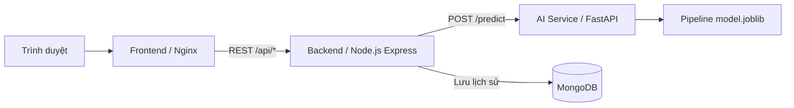

# Dự đoán bệnh thận mạn tính — Nhóm 12

## 1. Thành viên (họ tên, MSSV, phần việc)

## 2. Bài toán (mô tả, loại bài toán, cột mục tiêu, ý nghĩa thực tế)

Dự án xây dựng ứng dụng phân loại bệnh thận mạn tính từ 24 đặc trưng trong bộ dữ liệu Chronic Kidney Disease. Đây là bài toán **phân loại nhị phân**, với cột mục tiêu `classification`:

- `ckd`: lớp bệnh thận mạn tính.
- `notckd`: lớp không mắc bệnh thận mạn tính trong dataset.

Ứng dụng minh họa quy trình từ xử lý dữ liệu, huấn luyện đến phục vụ dự đoán qua web. Kết quả chỉ phục vụ học tập, không thay thế chẩn đoán của bác sĩ.

## 3. Dữ liệu (link Kaggle, giấy phép, mô tả cột, cách giải nén dataset.zip)

Nguồn: [Kaggle — Chronic Kidney Disease](https://www.kaggle.com/datasets/mansoordaku/ckdisease). Thông tin nguồn được ghi tại [DATA.md](ai-models/data/DATA.md).

Dataset nằm ở `ai-models/data/dataset.zip`, chứa `kidney_disease.csv`: 400 dòng, 26 cột gồm 24 đặc trưng, `id` và `classification`. Cột `id` không dùng để huấn luyện.

**Giấy phép:** tài liệu DATA.md hiện ghi “Unknown”; chưa có xác nhận giấy phép trong dự án.

| Cột | Ý nghĩa | Kiểu / đơn vị |
|---|---|---|
| age | Tuổi | Số, năm |
| bp | Huyết áp | Số, mmHg |
| sg | Tỷ trọng nước tiểu | Số |
| al | Albumin nước tiểu | Số, mức |
| su | Đường trong nước tiểu | Số, mức |
| bgr | Đường huyết ngẫu nhiên | Số, mg/dL |
| bu | Urê máu | Số, mg/dL |
| sc | Creatinine huyết thanh | Số, mg/dL |
| sod | Natri | Số, mEq/L |
| pot | Kali | Số, mEq/L |
| hemo | Hemoglobin | Số, g/dL |
| pcv | Thể tích hồng cầu | Số, % |
| wc | Số lượng bạch cầu | Số, /µL |
| rc | Số lượng hồng cầu | Số, triệu/µL |
| rbc | Hồng cầu trong nước tiểu | normal / abnormal |
| pc | Tế bào mủ | normal / abnormal |
| pcc | Cụm tế bào mủ | present / notpresent |
| ba | Vi khuẩn | present / notpresent |
| htn | Tăng huyết áp | yes / no |
| dm | Đái tháo đường | yes / no |
| cad | Bệnh động mạch vành | yes / no |
| appet | Cảm giác thèm ăn | good / poor |
| pe | Phù chi | yes / no |
| ane | Thiếu máu | yes / no |
| id | Mã bản ghi | Không dùng làm đặc trưng |
| classification | Nhãn mục tiêu sau làm sạch | ckd / notckd |

Tên/thứ tự trường, khoảng số và danh sách nhãn dùng trong ứng dụng lấy từ [schema.json](ai-models/models/schema.json). Khoảng số là phạm vi dữ liệu của model, không phải ngưỡng sức khỏe bình thường.

Notebook đọc trực tiếp CSV trong ZIP. Nếu muốn xem CSV, giải nén bằng PowerShell từ gốc dự án:

```powershell
Expand-Archive -LiteralPath ai-models/data/dataset.zip -DestinationPath ai-models/data/extracted
```

Thư mục `extracted/` chỉ phục vụ xem dữ liệu, không cần đưa lên Git.

## 4. Kết quả model (bảng so sánh metric, model được chọn và lý do)

Số liệu từ [evaluation_results.csv](ai-models/models/evaluation_results.csv):

| Model | Accuracy | Precision | Recall | F1 | ROC-AUC |
|---|---:|---:|---:|---:|---:|
| Logistic Regression | 1.0000 | 1.0000 | 1.0000 | 1.0000 | 1.0000 |
| Random Forest | 0.9875 | 0.9804 | 1.0000 | 0.9901 | 0.9993 |
| SVC | 0.9875 | 1.0000 | 0.9800 | 0.9899 | 1.0000 |
| KNN | 0.9750 | 1.0000 | 0.9600 | 0.9796 | 0.9987 |
| Dummy baseline | 0.6250 | 0.6250 | 1.0000 | 0.7692 | 0.5000 |

Có bốn model chính và một baseline. F1 của lớp CKD là metric chính; kết hợp Precision, Recall và ROC-AUC để đánh giá, thay vì chỉ nhìn Accuracy.

Model đang đóng gói là **Logistic Regression v1.0.0**: F1 và Recall đạt 1 trên tập đánh giá của dự án, pipeline nhỏ và phù hợp phục vụ qua API. Metadata ghi quy tắc chọn: F1 cách mức tốt nhất không quá 0,01, sau đó xét Recall, độ ổn định CV, độ trễ và kích thước. Các hình so sánh nằm trong [docs/figures](docs/figures/).

Các metric này không bảo đảm độ chính xác trên dữ liệu thực tế ngoài tập đánh giá.

## 5. Đóng gói model (đường dẫn file model trong repo, cách export từ Colab)

| File | Nội dung |
|---|---|
| [model.joblib](ai-models/models/model.joblib) | Pipeline tiền xử lý và classifier đã fit |
| [schema.json](ai-models/models/schema.json) | Hợp đồng 24 đặc trưng, kiểu, khoảng giá trị, nhãn |
| [metadata.json](ai-models/models/metadata.json) | Tên/version model, metric, ngày huấn luyện, phiên bản thư viện |

Pipeline gồm điền thiếu, StandardScaler cho biến số, OneHotEncoder cho biến phân loại và Logistic Regression. Backend không tự viết lại tiền xử lý.

Sau khi chạy notebook `04_evaluate.ipynb` trên Colab:

1. Chạy cell export cuối và tải `ckd_final_artifacts.zip`.
2. Giải nén, đặt bộ `model.joblib`, `schema.json`, `metadata.json` cùng lần huấn luyện vào `ai-models/models/`.
3. Đối chiếu requirements được export với `ai-models/requirements.txt` và `ai-models/service/requirements.txt`.
4. Chạy lại `docker compose up --build`.

Bộ model hiện tại ghi Python 3.13, scikit-learn 1.6.1, numpy 2.1.3, pandas 2.2.3, joblib 1.6.0. AI nạp model một lần khi container khởi động.

## 6. Kiến trúc hệ thống (sơ đồ FE - BE - AI - DB)



- **Frontend:** form tiếng Việt từ schema, kết quả, metric và “Xem cách tính”. Không hiển thị bảng lịch sử.
- **Backend:** validate, gọi AI có timeout, lưu dự đoán vào MongoDB, trả lỗi và request ID.
- **AI:** nạp pipeline, kiểm tra dữ liệu, trả nhãn/xác suất và đóng góp đặc trưng của Logistic Regression.
- **MongoDB:** lưu lịch sử; vẫn có API `GET /api/history` để kiểm tra.
- Ba service FE/BE/AI chạy container riêng; cùng MongoDB được nối bởi Compose network. Request ID được truyền xuyên FE → BE → AI.

Tài liệu từng phần: [AI Models](ai-models/README.md) · [Backend](app/backend/README.md) · [Frontend](app/frontend/README.md).

## 7. Chạy trên máy (yêu cầu: Docker; lệnh: cp .env.example .env; docker compose up --build)

Cần Docker và Docker Compose; trên Windows mở Docker Desktop với Linux containers. Chạy terminal tại thư mục chứa README này và `docker-compose.yml`.

Lần đầu, khi chưa có `.env`:

```sh
cp .env.example .env
docker compose up --build
```

Trong PowerShell có thể dùng `Copy-Item .env.example .env` thay cho `cp`. Không ghi đè `.env` đã cấu hình.

Muốn chạy nền:

```powershell
docker compose up --build -d
docker compose ps
```

Địa chỉ theo cấu hình mẫu:

| Thành phần | Địa chỉ |
|---|---|
| Giao diện | http://localhost:3000 |
| Health frontend | http://localhost:3000/health |
| Health backend | http://localhost:8000/health |
| Health AI | http://localhost:8001/health |
| Tài liệu API AI | http://localhost:8001/docs |

Mở giao diện → **Điền dữ liệu mẫu** → **Dự đoán** → **Xem cách tính**.
Health hiển thị status, port, uptime; backend kiểm tra AI/MongoDB, AI có `model_loaded`.

```powershell
docker compose logs -f frontend backend ai-service
docker compose stop
docker compose start
```

MongoDB chỉ nằm trong mạng Docker. Named volume giữ lịch sử khi tạo lại container; không dùng `down -v` nếu cần giữ dữ liệu.

## 8. Huấn luyện lại model (link Colab, thứ tự chạy notebook)

Mở [Google Colab](https://colab.research.google.com/) → **File → Upload notebook**, tải lên các notebook dưới đây. Hiện chưa có link Colab public riêng của nhóm.

| Thứ tự | Notebook | Nội dung |
|---|---|---|
| 1 | [01_eda.ipynb](ai-models/colab/01_eda.ipynb) | Khám phá dữ liệu, ≥5 hình và giải thích |
| 2 | [02_preprocess.ipynb](ai-models/colab/02_preprocess.ipynb) | Làm sạch, chia train/test, pipeline, schema |
| 3 | [03_train.ipynb](ai-models/colab/03_train.ipynb) | Baseline + 4 model, GridSearchCV |
| 4 | [04_evaluate.ipynb](ai-models/colab/04_evaluate.ipynb) | Đánh giá, chọn model, export artifact |

Upload `dataset.zip` khi notebook yêu cầu. Notebook 03 xuất `training_artifacts.zip`; upload file đó cùng dataset vào notebook 04. Giữ thống nhất feature, split 80/20 và random_state=42. Chạy các cell từ đầu đến cuối và giữ môi trường thư viện tương thích.

Sau export, đồng bộ artifact theo mục 5. Hướng dẫn chi tiết ở [README AI Models](ai-models/README.md).

## 9. Biến môi trường (bảng từng biến, ý nghĩa)

Root Compose đọc file `.env`; chỉ đưa `.env.example` lên Git.

| Biến | Mẫu | Ý nghĩa |
|---|---|---|
| FRONTEND_PORT | 3000 | Cổng Nginx trong container |
| FRONTEND_HOST_PORT | 3000 | Cổng frontend trên host |
| BACKEND_PORT | 8000 | Cổng Node.js trong container |
| BACKEND_HOST_PORT | 8000 | Cổng backend trên host |
| AI_PORT | 8001 | Cổng AI trong container |
| AI_HOST_PORT | 8001 | Cổng AI trên host |
| API_URL | /api | Đường dẫn API trình duyệt sử dụng |
| BACKEND_UPSTREAM | http://backend:8000 | Nginx gọi backend trong Docker network |
| AI_SERVICE_URL | http://ai-service:8001 | Backend gọi AI |
| MONGODB_URI | mongodb://mongodb:27017 | Kết nối MongoDB nội bộ |
| MONGODB_DATABASE | ckd_ai | Tên database |
| CORS_ORIGINS | http://localhost:3000 | Origin frontend được phép; phân cách bằng dấu phẩy |
| REQUEST_TIMEOUT_SECONDS | 10 | Timeout request từ backend tới AI |
| LOG_LEVEL | INFO | Mức log AI |
| PUBLIC_APP_URL | | Địa chỉ App public, dùng khi cập nhật tài liệu |
| PUBLIC_AI_URL | | Địa chỉ AI public, dùng khi cập nhật tài liệu |

Compose còn truyền `PORT` cho backend/AI, `SCHEMA_PATH=/app/model_artifacts/schema.json` cho backend và `MODEL_DIR=/app/models` cho AI. `NGINX_ENVSUBST_FILTER` giới hạn các biến được thay vào template Nginx.

`app/backend/.env` dùng riêng khi chạy `npm start` ngoài Docker; không thay thế root `.env`.
Đổi port nội bộ phải đổi URL phụ thuộc tương ứng. Đổi host port không yêu cầu đổi URL giữa các container.

## 10. Triển khai (cách public: deploy/tunnel, các bước, cách cập nhật khi đổi link)

## 11. Demo online (địa chỉ App, địa chỉ AI Service/docs — cập nhật mỗi khi đổi)

<!-- PUBLIC_URLS_START -->
- App: https://voters-capacity-florida-ste.trycloudflare.com
- AI Service: https://converter-acknowledged-proven-eds.trycloudflare.com
- Cập nhật cấu hình: 2026-09-25T07:08:39.806403+00:00
<!-- PUBLIC_URLS_END -->

## 12. Nhật ký đổi cổng/tunnel (thời điểm đổi, địa chỉ cũ → mới)

## 13. Kết quả kiểm thử hiệu năng

## 14. Hạn chế và hướng phát triển
