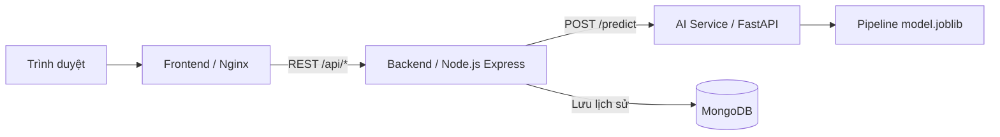

# Dự đoán bệnh thận mạn tính — Nhóm 12

## 1. Thành viên (họ tên, MSSV, phần việc)

| Họ và tên | MSSV | Phần việc |
|---|---:|---|
| Vũ Tiến Đạt | 10122121 | Phân tích khám phá dữ liệu và tiền xử lý; bổ sung dataset và data.md; xây dựng mã nguồn preprocess/train/evaluate ; phát triển frontend và đóng gói frontend bằng Docker ; cập nhật dependencies và URL ứng dụng . |
| Nguyễn Hồng Sơn | 12523075 | Huấn luyện, đánh giá và xuất artifact mô hình ; xây dựng AI Model API và kiểm thử ; xây dựng Backend API, validation, lưu lịch sử và kiểm thử ; bổ sung hình EDA/đánh giá ; cấu hình Docker Compose, triển khai và tunnel . |

## 2. Bài toán (mô tả, loại bài toán, cột mục tiêu, ý nghĩa thực tế)

Dự án xây dựng ứng dụng phân loại bệnh thận mạn tính từ 24 đặc trưng trong bộ dữ liệu Chronic Kidney Disease. Đây là bài toán **phân loại nhị phân**, với cột mục tiêu `classification`:

- `ckd`: lớp bệnh thận mạn tính.
- `notckd`: lớp không mắc bệnh thận mạn tính trong dataset.

Ứng dụng minh họa quy trình từ xử lý dữ liệu, huấn luyện đến phục vụ dự đoán qua web. Kết quả chỉ phục vụ học tập, không thay thế chẩn đoán của bác sĩ.

## 3. Dữ liệu (link Kaggle, giấy phép, mô tả cột, cách giải nén dataset.zip)

Nguồn: [Kaggle — Chronic Kidney Disease](https://www.kaggle.com/datasets/mansoordaku/ckdisease). Thông tin nguồn được ghi tại [DATA.md](ai-models/data/DATA.md).

Dataset nằm ở `ai-models/data/dataset.zip`, chứa `kidney_disease.csv`: 400 dòng, 26 cột gồm 24 đặc trưng, `id` và `classification`. Cột `id` không dùng để huấn luyện.

**Giấy phép:** tài liệu DATA.md hiện ghi “Unknown”; chưa có xác nhận giấy phép trong dự án.

| Cột | Ý nghĩa | Kiểu / đơn vị |
|---|---|---|
| age | Tuổi | Số, năm |
| bp | Huyết áp | Số, mmHg |
| sg | Tỷ trọng nước tiểu | Số |
| al | Albumin nước tiểu | Số, mức |
| su | Đường trong nước tiểu | Số, mức |
| bgr | Đường huyết ngẫu nhiên | Số, mg/dL |
| bu | Urê máu | Số, mg/dL |
| sc | Creatinine huyết thanh | Số, mg/dL |
| sod | Natri | Số, mEq/L |
| pot | Kali | Số, mEq/L |
| hemo | Hemoglobin | Số, g/dL |
| pcv | Thể tích hồng cầu | Số, % |
| wc | Số lượng bạch cầu | Số, /µL |
| rc | Số lượng hồng cầu | Số, triệu/µL |
| rbc | Hồng cầu trong nước tiểu | normal / abnormal |
| pc | Tế bào mủ | normal / abnormal |
| pcc | Cụm tế bào mủ | present / notpresent |
| ba | Vi khuẩn | present / notpresent |
| htn | Tăng huyết áp | yes / no |
| dm | Đái tháo đường | yes / no |
| cad | Bệnh động mạch vành | yes / no |
| appet | Cảm giác thèm ăn | good / poor |
| pe | Phù chi | yes / no |
| ane | Thiếu máu | yes / no |
| id | Mã bản ghi | Không dùng làm đặc trưng |
| classification | Nhãn mục tiêu sau làm sạch | ckd / notckd |

Tên/thứ tự trường, khoảng số và danh sách nhãn dùng trong ứng dụng lấy từ [schema.json](ai-models/models/schema.json). Khoảng số là phạm vi dữ liệu của model, không phải ngưỡng sức khỏe bình thường.

Notebook đọc trực tiếp CSV trong ZIP. Nếu muốn xem CSV, giải nén bằng PowerShell từ gốc dự án:

```powershell
Expand-Archive -LiteralPath ai-models/data/dataset.zip -DestinationPath ai-models/data/extracted
```

Thư mục `extracted/` chỉ phục vụ xem dữ liệu, không cần đưa lên Git.

## 4. Kết quả model (bảng so sánh metric, model được chọn và lý do)

Số liệu từ [evaluation_results.csv](ai-models/models/evaluation_results.csv):

| Model | Accuracy | Precision | Recall | F1 | ROC-AUC |
|---|---:|---:|---:|---:|---:|
| Logistic Regression | 1.0000 | 1.0000 | 1.0000 | 1.0000 | 1.0000 |
| Random Forest | 0.9875 | 0.9804 | 1.0000 | 0.9901 | 0.9993 |
| SVC | 0.9875 | 1.0000 | 0.9800 | 0.9899 | 1.0000 |
| KNN | 0.9750 | 1.0000 | 0.9600 | 0.9796 | 0.9987 |
| Dummy baseline | 0.6250 | 0.6250 | 1.0000 | 0.7692 | 0.5000 |

Có bốn model chính và một baseline. F1 của lớp CKD là metric chính; kết hợp Precision, Recall và ROC-AUC để đánh giá, thay vì chỉ nhìn Accuracy.

Model đang đóng gói là **Logistic Regression v1.0.0**: F1 và Recall đạt 1 trên tập đánh giá của dự án, pipeline nhỏ và phù hợp phục vụ qua API. Metadata ghi quy tắc chọn: F1 cách mức tốt nhất không quá 0,01, sau đó xét Recall, độ ổn định CV, độ trễ và kích thước. Các hình so sánh nằm trong [docs/figures](docs/figures/).

Các metric này không bảo đảm độ chính xác trên dữ liệu thực tế ngoài tập đánh giá.

## 5. Đóng gói model (đường dẫn file model trong repo, cách export từ Colab)

| File | Nội dung |
|---|---|
| [model.joblib](ai-models/models/model.joblib) | Pipeline tiền xử lý và classifier đã fit |
| [schema.json](ai-models/models/schema.json) | Hợp đồng 24 đặc trưng, kiểu, khoảng giá trị, nhãn |
| [metadata.json](ai-models/models/metadata.json) | Tên/version model, metric, ngày huấn luyện, phiên bản thư viện |

Pipeline gồm điền thiếu, StandardScaler cho biến số, OneHotEncoder cho biến phân loại và Logistic Regression. Backend không tự viết lại tiền xử lý.

Sau khi chạy notebook `04_evaluate.ipynb` trên Colab:

1. Chạy cell export cuối và tải `ckd_final_artifacts.zip`.
2. Giải nén, đặt bộ `model.joblib`, `schema.json`, `metadata.json` cùng lần huấn luyện vào `ai-models/models/`.
3. Đối chiếu requirements được export với `ai-models/requirements.txt` và `ai-models/service/requirements.txt`.
4. Chạy lại `docker compose up --build`.

Bộ model hiện tại ghi Python 3.13, scikit-learn 1.6.1, numpy 2.1.3, pandas 2.2.3, joblib 1.6.0. AI nạp model một lần khi container khởi động.

## 6. Kiến trúc hệ thống (sơ đồ FE - BE - AI - DB)


```mermaid
flowchart LR
    U[Trình duyệt] --> FE[Frontend / Nginx]
    FE -->|REST /api/*| BE[Backend / Node.js Express]
    BE -->|POST /predict| AI[AI Service / FastAPI]
    BE -->|Lưu lịch sử| DB[(MongoDB)]
    AI --> M[Pipeline model.joblib]
```

- **Frontend:** form tiếng Việt từ schema, kết quả, metric và “Xem cách tính”. Không hiển thị bảng lịch sử.
- **Backend:** validate, gọi AI có timeout, lưu dự đoán vào MongoDB, trả lỗi và request ID.
- **AI:** nạp pipeline, kiểm tra dữ liệu, trả nhãn/xác suất và đóng góp đặc trưng của Logistic Regression.
- **MongoDB:** lưu lịch sử; vẫn có API `GET /api/history` để kiểm tra.
- Ba service FE/BE/AI chạy container riêng; cùng MongoDB được nối bởi Compose network. Request ID được truyền xuyên FE → BE → AI.

Tài liệu từng phần: [AI Models](ai-models/README.md) · [Backend](app/backend/README.md) · [Frontend](app/frontend/README.md).

## 7. Chạy trên máy (yêu cầu: Docker; lệnh: cp .env.example .env; docker compose up --build)

Cần Docker và Docker Compose; trên Windows mở Docker Desktop với Linux containers. Chạy terminal tại thư mục chứa README này và `docker-compose.yml`.

Lần đầu, khi chưa có `.env`:

```sh
cp .env.example .env
docker compose up --build
```

Trong PowerShell có thể dùng `Copy-Item .env.example .env` thay cho `cp`. Không ghi đè `.env` đã cấu hình.

Muốn chạy nền:

```powershell
docker compose up --build -d
docker compose ps
```

Địa chỉ theo cấu hình mẫu:

| Thành phần | Địa chỉ |
|---|---|
| Giao diện | http://localhost:3000 |
| Health frontend | http://localhost:3000/health |
| Health backend | http://localhost:8000/health |
| Health AI | http://localhost:8001/health |
| Tài liệu API AI | http://localhost:8001/docs |

Mở giao diện → **Điền dữ liệu mẫu** → **Dự đoán** → **Xem cách tính**.
Health hiển thị status, port, uptime; backend kiểm tra AI/MongoDB, AI có `model_loaded`.

```powershell
docker compose logs -f frontend backend ai-service
docker compose stop
docker compose start
```

MongoDB chỉ nằm trong mạng Docker. Named volume giữ lịch sử khi tạo lại container; không dùng `down -v` nếu cần giữ dữ liệu.

## 8. Huấn luyện lại model (link Colab, thứ tự chạy notebook)

Mở [Google Colab](https://colab.research.google.com/) → **File → Upload notebook**, tải lên các notebook dưới đây. Hiện chưa có link Colab public riêng của nhóm.

| Thứ tự | Notebook | Nội dung |
|---|---|---|
| 1 | [01_eda.ipynb](ai-models/colab/01_eda.ipynb) | Khám phá dữ liệu, ≥5 hình và giải thích |
| 2 | [02_preprocess.ipynb](ai-models/colab/02_preprocess.ipynb) | Làm sạch, chia train/test, pipeline, schema |
| 3 | [03_train.ipynb](ai-models/colab/03_train.ipynb) | Baseline + 4 model, GridSearchCV |
| 4 | [04_evaluate.ipynb](ai-models/colab/04_evaluate.ipynb) | Đánh giá, chọn model, export artifact |

Upload `dataset.zip` khi notebook yêu cầu. Notebook 03 xuất `training_artifacts.zip`; upload file đó cùng dataset vào notebook 04. Giữ thống nhất feature, split 80/20 và random_state=42. Chạy các cell từ đầu đến cuối và giữ môi trường thư viện tương thích.

Sau export, đồng bộ artifact theo mục 5. Hướng dẫn chi tiết ở [README AI Models](ai-models/README.md).

## 9. Biến môi trường (bảng từng biến, ý nghĩa)

Root Compose đọc file `.env`; chỉ đưa `.env.example` lên Git.

| Biến | Mẫu | Ý nghĩa |
|---|---|---|
| FRONTEND_PORT | 3000 | Cổng Nginx trong container |
| FRONTEND_HOST_PORT | 3000 | Cổng frontend trên host |
| BACKEND_PORT | 8000 | Cổng Node.js trong container |
| BACKEND_HOST_PORT | 8000 | Cổng backend trên host |
| AI_PORT | 8001 | Cổng AI trong container |
| AI_HOST_PORT | 8001 | Cổng AI trên host |
| API_URL | /api | Đường dẫn API trình duyệt sử dụng |
| BACKEND_UPSTREAM | http://backend:8000 | Nginx gọi backend trong Docker network |
| AI_SERVICE_URL | http://ai-service:8001 | Backend gọi AI |
| MONGODB_URI | mongodb://mongodb:27017 | Kết nối MongoDB nội bộ |
| MONGODB_DATABASE | ckd_ai | Tên database |
| CORS_ORIGINS | http://localhost:3000 | Origin frontend được phép; phân cách bằng dấu phẩy |
| REQUEST_TIMEOUT_SECONDS | 10 | Timeout request từ backend tới AI |
| LOG_LEVEL | INFO | Mức log AI |
| PUBLIC_APP_URL | | Địa chỉ App public, dùng khi cập nhật tài liệu |
| PUBLIC_AI_URL | | Địa chỉ AI public, dùng khi cập nhật tài liệu |

Compose còn truyền `PORT` cho backend/AI, `SCHEMA_PATH=/app/model_artifacts/schema.json` cho backend và `MODEL_DIR=/app/models` cho AI. `NGINX_ENVSUBST_FILTER` giới hạn các biến được thay vào template Nginx.

`app/backend/.env` dùng riêng khi chạy `npm start` ngoài Docker; không thay thế root `.env`.
Đổi port nội bộ phải đổi URL phụ thuộc tương ứng. Đổi host port không yêu cầu đổi URL giữa các container.

## 10. Triển khai (cách public: deploy/tunnel, các bước, cách cập nhật khi đổi link)

Hệ thống chạy bằng Docker Compose trên máy cá nhân và được public bằng Cloudflare Quick Tunnel:
- App: tunnel tới frontend; các request `/api` được Nginx chuyển tới backend.
- AI Service: sử dụng tunnel riêng tới FastAPI.

Các bước triển khai:
1. Mở Docker Desktop.
2. Tại thư mục gốc repo, khởi động cả ứng dụng và hai tunnel bằng **cả hai file Compose**:

   ```powershell
   docker compose -f .\docker-compose.yml -f .\docker-compose.tunnel.yml up --build
   ```

   Chỉ chạy `docker compose up --build` sẽ không nạp `docker-compose.tunnel.yml`, nên hai tunnel sẽ không được tạo.
3. Lấy URL `trycloudflare.com` mới từ log của `tunnel-app` và `tunnel-ai`. Có thể xem log trong cửa sổ PowerShell khác:

   ```powershell
   docker compose -f .\docker-compose.yml -f .\docker-compose.tunnel.yml logs -f tunnel-app tunnel-ai
   ```

4. Kiểm tra App, Backend và AI Service hoạt động qua URL public; thử một dự đoán và kiểm tra log/request ID.

Khi URL tunnel thay đổi, cập nhật giá trị URL public và cấu hình CORS cần thiết trong `.env`, cập nhật mục 11 và ghi lại URL cũ/mới cùng thời điểm tại mục 12. Sau đó kiểm tra lại hệ thống public. Dừng các service bằng `Ctrl+C` ở cửa sổ đang chạy Compose.

## 11. Demo online (địa chỉ App, địa chỉ AI Service/docs — cập nhật mỗi khi đổi)

<!-- PUBLIC_URLS_START -->
- App (URL được ghi nhận gần nhất): https://travelling-agencies-thus-includes.trycloudflare.com
- AI Service (URL được ghi nhận gần nhất): https://converter-acknowledged-proven-eds.trycloudflare.com
- AI API docs: https://converter-acknowledged-proven-eds.trycloudflare.com/docs
- Thời điểm ghi nhận trong cấu hình: 2026-09-25 07:08:39 UTC
<!-- PUBLIC_URLS_END -->

> Đây là Cloudflare Quick Tunnel nên URL có thể đổi khi tunnel được khởi động lại. Các URL trên là lần ghi nhận gần nhất trong repository, **không bảo đảm hiện vẫn truy cập được**. Trước khi gửi link hoặc demo, khởi động tunnel bằng lệnh ở mục 10, kiểm tra URL mới trong log `tunnel-app`/`tunnel-ai`, rồi cập nhật khối này và mục 12.

## 12. Nhật ký đổi cổng/tunnel (thời điểm đổi, địa chỉ cũ → mới)

| Thời điểm (UTC) | Thành phần | Địa chỉ cũ | Địa chỉ mới | Ghi chú |
|---|---|---|---|---|
| 2026-09-25 07:08:39 | App | Không lưu trong repository | `https://travelling-agencies-thus-includes.trycloudflare.com` | URL hiện có trong cấu hình/README tại thời điểm đó. |
| 2026-09-25 07:08:39 | AI Service | Không lưu trong repository | `https://converter-acknowledged-proven-eds.trycloudflare.com` | 
| 2026-10-03 07:30:39 | App | Không lưu trong repository | `https://jpg-obvious-supplements-harder.trycloudflare.com` | URL hiện có trong cấu hình/README tại thời điểm đó. | 

Khi Quick Tunnel cấp URL khác, bổ sung một dòng cho **mỗi thành phần** với thời điểm thực tế, URL cũ và mới; đồng thời cập nhật `.env`/CORS nếu cần, mục 11 và chạy smoke test qua địa chỉ public.
## 13. Kết quả kiểm thử hiệu năng

### Đo thời gian suy luận model

Các số dưới đây lấy từ `ai-models/models/evaluation_results.csv`. Đây là thời gian gọi model dự đoán trong quy trình đánh giá notebook, tính trung bình trên một mẫu của tập test; **không phải** thời gian phản hồi end-to-end của website/API và cũng không phải load test đồng thời.

| Model | Thời gian suy luận trung bình (ms/mẫu) | Kích thước artifact |
|---|---:|---:|
| Dummy baseline | 0,161 | 2.206 B |
| Logistic Regression (được đóng gói) | 0,193 | 2.665 B |
| SVC | 0,219 | 5.342 B |
| KNN | 0,402 | 17.625 B |
| Random Forest | 0,822 | 61.050 B |

Các phép đo phụ thuộc môi trường và cỡ batch; không dùng chúng để khẳng định tốc độ trên máy chủ public.

### Kiểm thử chức năng và giao diện

Backend có **6/6 test PASS**, AI Service có **17 test PASS**, smoke test toàn hệ thống có **27 PASS – 0 FAIL – 0 BLOCKED**. Browser test trên viewport 390 px hoàn thành không tràn ngang/page error; đã kiểm tra form 24 trường, dự đoán, history và cách tính. Các kết quả này là kết quả được ghi trong báo cáo của nhóm.

### Load test toàn luồng

Báo cáo ghi nhận load generator có warm-up trước mỗi lượt và gửi request qua `http://localhost:3000/api/predict`, bao gồm luồng FE → BE → AI → DB. Kết quả:

| Người dùng đồng thời | Thời lượng (s) | Requests | Throughput (RPS) | p50 (ms) | p95 (ms) | Lỗi |
|---:|---:|---:|---:|---:|---:|---:|
| 10 | 60,343 | 1.196 | 19,82 | 504,73 | 710,93 | 0/1.196 (0%) |
| 20 | 60,403 | 1.081 | 17,90 | 1.123,78 | 1.592,10 | 0/1.081 (0%) |

Ở hai mức đã thử, p95 dưới 2 giây và tỷ lệ lỗi dưới 1%, phù hợp với mục tiêu tham khảo trong hướng dẫn môn học. Đây là benchmark **localhost trong môi trường thử nghiệm**, không phải benchmark qua Cloudflare tunnel/cloud và không phải SLA. Chỉ mới kiểm thử đến 20 người dùng; chưa xác định tải tối đa. RPS có thể thay đổi theo tài nguyên nền và trạng thái máy.


## 14. Hạn chế và hướng phát triển

### Hạn chế hiện tại

- **Quy mô và tính đại diện dữ liệu:** dataset có 400 mẫu từ một nguồn công khai; kết quả trên split hiện tại không chứng minh khả năng tổng quát hóa sang bệnh viện, quần thể hoặc quy trình xét nghiệm khác.
- **License:** `ai-models/data/DATA.md` ghi license của dataset trên Kaggle là **Unknown**. Cần xác minh điều kiện sử dụng/phân phối trước khi công bố lại dữ liệu hoặc dùng ngoài mục đích học tập.
- **Đánh giá model:** pipeline và GridSearchCV giúp fit bước tiền xử lý trong từng fold, nhưng script hiện tính metric các ứng viên trên holdout rồi chọn model dựa trên kết quả đó. Do holdout đã tham gia lựa chọn, các metric test có thể lạc quan; cần chọn model bằng CV trên train và chỉ chấm test độc lập một lần.
- **Ứng dụng không phải thiết bị y tế:** nhãn và xác suất chỉ minh họa đầu ra mô hình trên dataset, không phải chẩn đoán, tư vấn hoặc quyết định điều trị.
- **Schema range:** min/max trong `schema.json` mô tả phạm vi quan sát của dữ liệu, không phải ngưỡng sinh lý bình thường; input ngoài phạm vi hiện bị từ chối.
- **Giải thích dự đoán:** phần “Xem cách tính” phân rã log-odds của Logistic Regression; không chứng minh quan hệ nhân quả và không thay thế giải thích lâm sàng.
- **Vận hành public:** Cloudflare Quick Tunnel có thể đổi hostname hoặc ngắt khi máy/container dừng. Các URL ở mục 11 là lần ghi nhận gần nhất, cần xác minh ngay trước demo.
- **Hiệu năng tải:** đã có load test localhost ở 10 và 20 người dùng đồng thời, nhưng chưa có phép đo trên public tunnel/cloud hoặc xác định capacity tối đa. Raw JSON được báo cáo tham chiếu hiện chưa có trong repository.
- **An toàn và quyền riêng tư:** báo cáo ghi hệ thống chưa có đầy đủ authentication, phân quyền, mã hóa và audit log; không dùng với dữ liệu bệnh nhân thật hoặc public như dịch vụ y tế.
- **Vận hành production:** chưa có monitoring production, CI/CD và cơ chế rollback.

### Hướng phát triển

1. Xác minh license và nguồn gốc dữ liệu; bổ sung tập dữ liệu lớn hơn, đa nguồn và được phép sử dụng.
2. Thiết kế đánh giá không rò rỉ thông tin: stratified cross-validation chỉ trên train để chọn model/siêu tham số; khóa lựa chọn trước khi đánh giá test; bổ sung external validation và khoảng tin cậy.
3. Đánh giá các ngưỡng phân loại, calibration xác suất, độ nhạy/độ đặc hiệu và hiệu năng theo nhóm dữ liệu; chỉ chọn ngưỡng với tư vấn chuyên môn.
4. Lưu các file raw load test trong repository; lặp lại benchmark có kiểm soát và chạy thêm qua public endpoint, đồng thời kiểm tra timeout hoặc MongoDB/AI Service không sẵn sàng.
5. Bổ sung xác thực, phân quyền, mã hóa phù hợp, chính sách lưu trữ và audit log trước khi xử lý dữ liệu nhạy cảm.
6. Bổ sung monitoring, CI/CD và quy trình rollback có kiểm thử.
7. Cải thiện độ ổn định triển khai bằng hostname cố định hoặc nền tảng deploy phù hợp; tự động cập nhật tài liệu tunnel và kiểm tra health sau mỗi lần đổi URL.